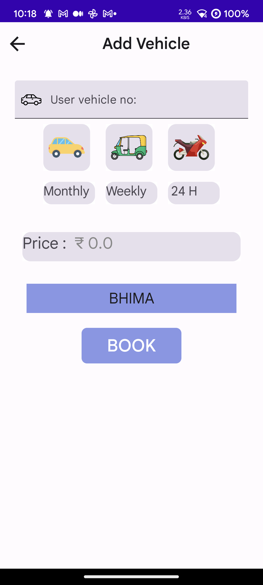
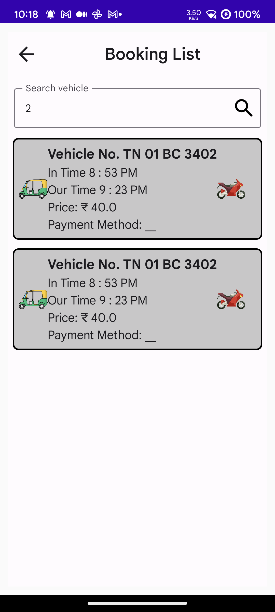
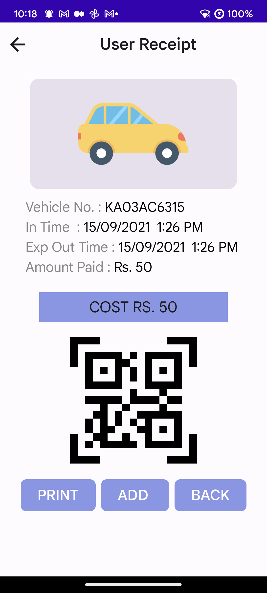

# Food-Maniac

Vehicle App is a simple application to demonstrate the use of Clean Architecture, MVVM,
Multi-Module, build with Jetpack Compose and Material-3 guidelines along with some Modern Android
development tools.

---

# Tech Stack Used

- [MVVM Architecture](https://developer.android.com/topic/architecture) - A software architecture
  that removes the tight coupling between components. Most importantly, in this architecture, the
  children don't have the direct reference to the parent, they only have the reference by
  observables.
- [Hilt](https://dagger.dev/hilt/) - Hilt provides a standard way to incorporate Dagger dependency
  injection into an Android application.
- [Jetpack Components](https://developer.android.com/jetpack)
    - [Jetpack Compose](https://developer.android.com/jetpack/compose)- Modern toolkit for building
      native UI.
    - [Android KTX](https://developer.android.com/kotlin/ktx.html) - Provide concise, idiomatic
      Kotlin to Jetpack and Android platform APIs.
    - [AndroidX](https://developer.android.com/jetpack/androidx) - Major improvement to the original
      Android [Support Library](https://developer.android.com/topic/libraries/support-library/index),
      which is no longer maintained.
    - [Lifecycle](https://developer.android.com/topic/libraries/architecture/lifecycle) - Perform
      actions in response to a change in the lifecycle status of another component, such as
      activities and fragments.
    - [Room](https://developer.android.com/training/data-storage/room) - Provides an abstraction
      layer over SQLite used for offline data caching.
    - [Preferences Datastore](https://developer.android.com/topic/libraries/architecture/datastore) -
      Jetpack DataStore is a data storage solution that allows you to store key-value pairs or typed
      objects with protocol buffers. DataStore uses Kotlin coroutines and Flow to store data
      asynchronously, consistently, and transactionally.
    - [ViewModel](https://developer.android.com/topic/libraries/architecture/viewmodel) - Designed
      to store and manage UI-related data in a lifecycle conscious way. The ViewModel class allows
      data to survive configuration changes such as screen rotations.
- [Landscapist - CoilImage Loader](https://github.com/skydoves/landscapist) - Landscapist is a
  Jetpack Compose image loading library which fetches and displays network images with **Glide**, *
  *Coil**, and **Fresco**.
- [Compose Pagination](https://developer.android.com/jetpack/androidx/releases/paging) - The Paging
  Library makes it easier for you to load data gradually and gracefully within your app.
- [Retrofit](https://square.github.io/retrofit/) - Type-safe http client
  and supports coroutines out of the box.
- [Lottie Files for Compose](https://github.com/airbnb/lottie) - Lottie is a library for Android,
  iOS, and Web that parses [Adobe After Effects](http://www.adobe.com/products/aftereffects.html)
  animations exported as json with [Bodymovin](https://github.com/airbnb/lottie-web) and renders
  them natively on mobile and on the web!
- [GSON](https://github.com/square/gson) - JSON Parser,used to parse
  requests on the data layer for Entities and understands Kotlin non-nullable
  and default parameters.
- [OkHttp Logging Interceptor](https://github.com/square/okhttp/blob/master/okhttp-logging-interceptor/README.md) -
  Logs HTTP request and response data.
- [Coroutines](https://github.com/Kotlin/kotlinx.coroutines) - Library Support for coroutines.
- [Flows](https://developer.android.com/kotlin/flow) - Flows are built on top of coroutines and can
  provide multiple values. A flow is conceptually a stream of data that can be computed
  asynchronously.
- [Timber](https://github.com/JakeWharton/timber) - Library for easier logging.
- [Material 3 Theming]() - Dark And Light Mode Feature is also built in using Material 3 Theming
  GuideLine.

---

# Screenshots

   
---
---

> PRs are welcome :)

---

## License

[MIT License](LICENSE)